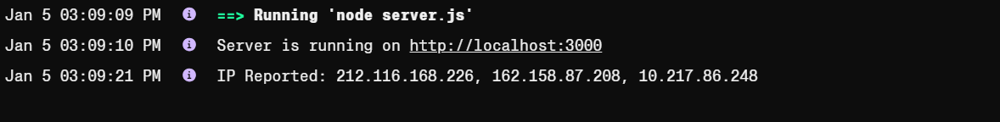

# Tox.chat

Tox.chat היא אפליקציה מבוססת קוד פתוח המיועדת לתקשורת מאובטחת בין משתמשים. היא פותחה במטרה לספק אלטרנטיבה חופשית ופשוטה לשירותי צ'אט מסורתיים המסתמכים על שרתים מרכזיים ולא להשתמש בצד שלישי.

### 📋 השימושים העיקריים באפליקציה כוללים:

1. **שיחות טקסט** – העברת הודעות מיידיות בין משתמשים באופן מוצפן.
2. **שיחות קול ווידאו** – ביצוע שיחות קוליות ושיחות וידאו מאובטחות באיכות גבוהה.
3. **שיתוף קבצים** – העברת קבצים בין משתמשים בצורה מאובטחת וללא הגבלת גודל.
4. **קבוצות צ'אט** – יצירת קבוצות שיחה לתקשורת קבוצתית פרטית.

Tox.chat מבוססת על טכנולוגיית **P2P (peer-to-peer)** כך שכל התקשורת נעשית ישירות בין המכשירים של המשתמשים, ללא תלות בשרתים חיצוניים. מאפיין זה, בשילוב עם ההצפנה מקצה-לקצה, מבטיח פרטיות מלאה ומונע גישה של צד שלישי להודעות ולמידע המועבר באפליקציה.

### 📂 הפלטפורמות הנתמכות:
1. **ווינדוס** – גרסה מלאה עם תמיכה בצ'אט, שיחות קול ווידאו ושיתוף קבצים.
2. **מאקOS** - אפליקציה תואמת עם ממשק ידידותי ותמיכה בתכונות הליבה.
3. **לינוקס** - קיימות חבילות ייעודיות לרוב ההפצות הפופולריות.
4. **אנדרואיד**  - אפליקציה בשם **Antox** עבור משתמשי אנדרואיד. (לא זמינה לגרסאות אנדרואיד החדשות).
5. **מכשיר אפל** - אפליקציה בשם **µTox** או פרויקטים דומים המותאמים ל-iPhone ול-iPad.

### 🔽 איך להוריד:

1. בקר באתר הרשמי של **Tox.chat**: [https://tox.chat](https://tox.chat)
2. בחר בלשונית **Downloads** כדי לראות את הגרסאות השונות הזמינות להורדה.
3. בחר את הגרסה המתאימה למערכת ההפעלה שלך.
4. עקוב אחר ההוראות להתקנה והתחברות.

#### בלינוקס:

אם הורד קובץ `.AppImage`, יש להפוך אותו לקובץ הרצה ואז לפתוח:

```bash
chmod +x name-of-file.AppImage
./name-of-file.AppImage
```

טוקס הוא פרויקט קוד פתוח, ולכן ייתכנו מספר יישומים שונים המבוססים על הפרוטוקול שלו, כולל **qTox**, **uTox**, ו-**Ricochet**, כך שניתן לבחור את הלקוח המועדף בהתאם לצרכים ולממשק.

### 📝 היסטוריית צ'אט ושיחזור משתמש

כל ההיסטוריה נשמרת באופן מקומי. במידה ולא נשמר, יש להיכנס להגדרות ולסמן ”וי“ על האפשרות לשמירת ההיסטוריה. כדי לגשת להיסטוריה או לשנות הודעות קיימות ולייצא לצ'אט לקובץ אקסל, בצע את השלבים הבאים:

#### 🔍 מיקומי קבצי ההיסטוריה:

- **linux**: `~/.config/tox`
- **windows**: `%APPDATA%/Roaming/Tox`

הקבצים החשובים:

- **qtox.ini** – קובץ הגדרות גלובליות.
- **profile.ini** – קובץ הגדרות משתמש.
- **profile.tox** – פרופיל Tox של המשתמש.
- **profile.db** – היסטוריית צ'אט.
- **avatars/** – מטמון אווטאר של החברים.

### 🔑 איך ליצור משתמש ב-Tox:

1. לחץ על **New Profile**.
2. הזן שם משתמש וסיסמה.
3. לחץ על **Create Profile**.
   

### 💬 איך להתחיל שיחה עם משתמשים אחרים:

1. שלח את ה-Tox ID שלך דרך פלטפורמה אחרת למשתמש הרצוי.
2. המשתמש השני ישלח בקשת חברות באמצעות ה-Tox ID שסיפקת.
3. לאחר קבלת הבקשה, יש לאשר אותה.
   
   

### 👥 איך לפתוח ולצרף לקבוצה:


### 🗂️ איך לפתוח את קובץ ה-profile.db:

1. **הורד את DB Browser for SQLite** מהאתר הרשמי: [sqlitebrowser.org](https://sqlitebrowser.org).
2. **מחק את הסיסמה הזמנית**: היכנס להגדרות הצ'אט ומחק את הסיסמה כדי להסיר הגבלות גישה.
3. **פתח את קובץ SQLite**: בחר באפשרות **Open Database** וטען את הקובץ **profile.db**.
4. **עיין בטבלת ההודעות**: לחץ לחיצה ימנית על **text_messages** ובחר **Browse Table** כדי לצפות בהודעות.
5. **ייצוא לאקסל**: השתמש באפשרות **Export** לשמירת הנתונים כ-CSV או Excel.
   

### 🌐 שינוי Proxy של הפרופיל:

בתפריט ההגדרות, ניתן לבחור סוגי פרוקסי ולהגדיר כתובת ופורטים. פעולה זו מוסיפה שכבת הגנה ומסתירה את כתובת ה-IP שלך.


### 🔎 תובנות מחקירה:

- שימוש ב-VPN מונע גילוי כתובת ה-IP.
- שינוי Proxy עלול לשנות את ה-IP אך עשוי להקשות על שמירת השינויים.
- ניתן להשתמש ב-Wireshark או IPLogger כדי לגלות כתובת IP אם לא נעשה שימוש ב-VPN/Proxy.
- בעת שליחת תמונות, המטא-נתונים (metadata) לא נמחקים, ואפשר להשתמש בכלים לגילוי תוכן זה.

### ⚙️ דוגמאות טכניות:

- בעת התקשרות, Tox משתמשת בפרוטוקול **UDP** בפורט **3345**.
- כלים כמו **IPLogger** מציגים את כתובות ה-IP של המשתמשים המחוברים.





